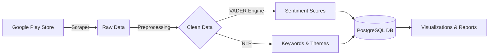
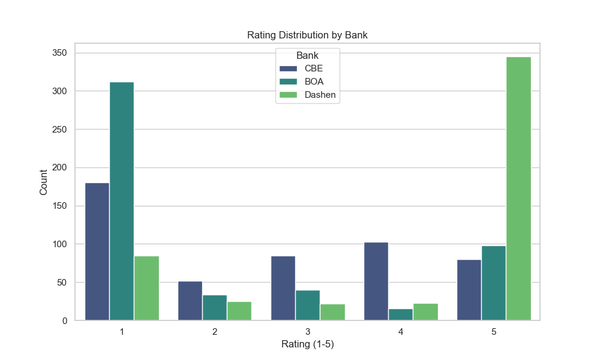
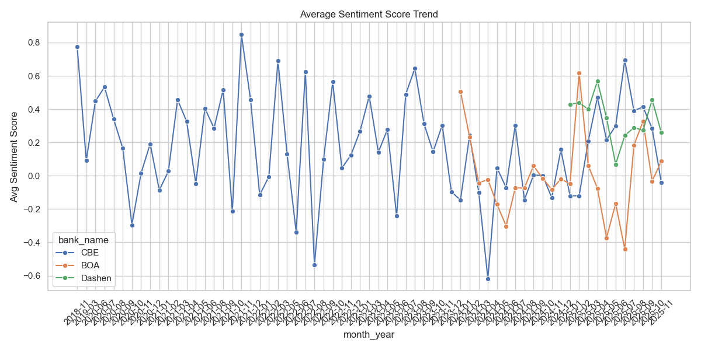

<div align="center">

# 📱 Fintech Mobile CX Analytics
### *Unlocking Customer Insights through Data*

[](https://git.io/typing-svg)

[](https://www.python.org/)
[](https://www.postgresql.org/)
[](https://jupyter.org/)
[](https://pandas.pydata.org/)
[](LICENSE)

[View Demo](#-visualizations) • [Report Bug](issues) • [Request Feature](issues)

</div>

---

## 🚀 **Project Overview**

**Fintech Mobile CX Analytics** is an end-to-end automated pipeline designed to analyze customer sentiment for Ethiopia's top banking applications: **Commercial Bank of Ethiopia (CBE)**, **Bank of Abyssinia (BOA)**, and **Dashen Bank**.

By leveraging **Natural Language Processing (NLP)** and **Machine Learning**, this project transforms raw Google Play Store reviews into actionable business strategies, helping banks reduce churn and improve user satisfaction.

---

## 💎 **Key Features**

| Feature | Description |
| :--- | :--- |
| 🕷️ **Automated Scraping** | Fetches thousands of real-time reviews using `google-play-scraper`. |
| 🧹 **Smart Preprocessing** | Advanced cleaning pipeline (Deduplication, Normalization, Lemmatization). |
| 🧠 **Sentiment Engine** | Powered by **VADER** to classify feedback as Positive, Neutral, or Negative. |
| 🔍 **Topic Modeling** | Extracts hidden themes and N-grams to identify specific pain points. |
| 🗄️ **Data Warehousing** | Robust storage using **PostgreSQL** for scalable analytics. |
| 📊 **Interactive Dashboard** | Beautiful visualizations generated via Matplotlib & Seaborn. |

---

## 🏗️ **Architecture**



---

## 📂 **Project Structure**

```bash
project/
├── 📂 data/                 # Data storage
│   ├── 📂 raw/              # Raw scraped reviews
│   ├── 📂 clean/            # Preprocessed datasets
│   └── 📂 processed/        # Sentiment analysis results
│
├── 📂 database/             # Database scripts
│   ├── schema.sql           # Table definitions
│   └── queries.sql          # Analytical queries
│
├── 📂 notebooks/            # Interactive Analysis
│   ├── 01_scraping.ipynb
│   ├── 02_preprocessing.ipynb
│   ├── 03_sentiment_analysis.ipynb
│   ├── 04_topic_modeling.ipynb
│   └── 05_visualizations.ipynb
│
├── 📂 scripts/              # Production Pipeline
│   ├── scraper.py
│   ├── preprocess.py
│   ├── sentiment_analysis.py
│   ├── keyword_thematic.py
│   ├── db_upload.py
│   └── main_pipeline.py     # 🚀 ORCHESTRATOR
│
├── 📂 reports/              # Final Deliverables
│   ├── 📂 dashboard/        # Generated Plots
│   └── final_report.md      # Executive Summary
│
└── README.md                # You are here!
```

---

## ⚡ **Getting Started**

### **Prerequisites**
*   Python 3.8+
*   PostgreSQL

### **Installation**

1.  **Clone the repository**
    ```bash
    git clone https://github.com/Miftah-Ebrahim/Fintech-Mobile-CX-Analytics.git
    cd Fintech-Mobile-CX-Analytics
    ```

2.  **Create Virtual Environment**
    ```bash
    python -m venv venv
    source venv/bin/activate  # On Windows: venv\Scripts\activate
    ```

3.  **Install Dependencies**
    ```bash
    pip install -r requirements.txt
    ```

4.  **Configure Database**
    *   Create a database named `bank_reviews` in PostgreSQL.
    *   Update `.env` file with your credentials:
        ```ini
        DB_HOST=localhost
        DB_NAME=bank_reviews
        DB_USER=postgres
        DB_PASS=your_password
        ```

---

## 🏃 **Usage**

### **Option 1: Run Full Pipeline**
Execute the master script to run all stages (Preprocessing → Analysis → Database Upload):
```bash
python scripts/main_pipeline.py
```

### **Option 2: Interactive Notebooks**
Explore the data step-by-step using Jupyter:
```bash
jupyter notebook notebooks/
```

---

## 📊 **Visualizations**

<div align="center">
  
  
</div>

> *Sample insights generated from the analysis pipeline.*

---

## 🏆 **Results & Insights**

*   **CBE:** High friction in login processes (`"Connection Error"`).
*   **BOA:** Recent updates caused stability issues (`"App Crash"`).
*   **Dashen:** Strong feature set but integration issues with Amole (`"Wallet Sync"`).

👉 **[Read the Full Report](reports/final_report.md)**

---

<div align="center">

### *Built with ❤️ by Mifta Y*

</div>
