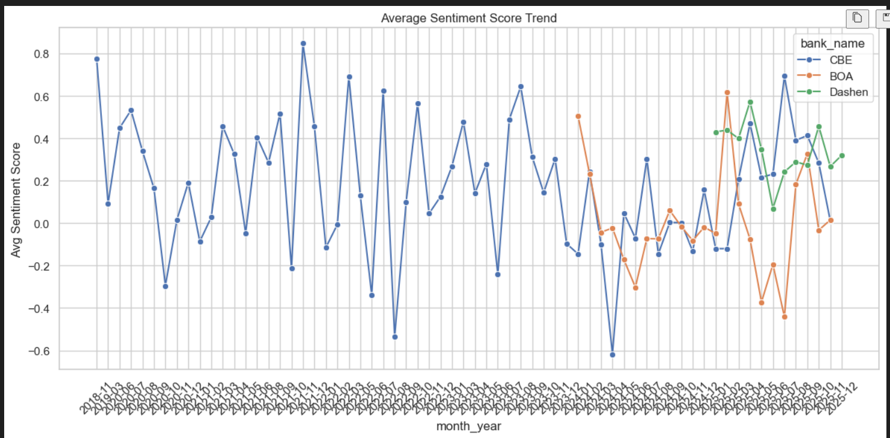
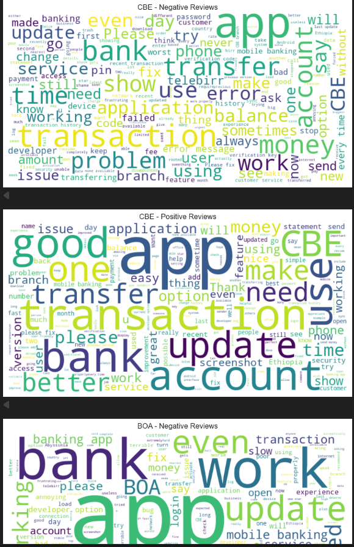

# 📱 Fintech Mobile CX Analytics: Final Project Report

**Date:** December 2, 2025  
**Author:** Mifta Y  
**Subject:** Comparative Sentiment Analysis of Ethiopian Banking Apps (CBE, BOA, Dashen)

---

## 1. Project Understanding

### 1.1 Business Context
The Ethiopian fintech sector is rapidly digitizing, with mobile banking becoming the primary touchpoint for millions of customers. However, user experience (CX) remains inconsistent. For **Commercial Bank of Ethiopia (CBE)**, **Bank of Abyssinia (BOA)**, and **Dashen Bank**, understanding customer sentiment is no longer optional—it is critical for retention and competitive advantage.

### 1.2 Problem Statement
Banks currently lack a real-time, automated mechanism to gauge customer satisfaction. Reliance on manual review reading is inefficient and unscalable. This project aims to solve this by building an **end-to-end automated pipeline** that scrapes, processes, and analyzes Google Play Store reviews to uncover hidden pain points and satisfaction drivers.

### 1.3 Methodology
We adopted a data-driven approach using Python:
1.  **Data Collection:** Automated scraping of 1,500 reviews (500 per bank) from the Google Play Store.
2.  **Preprocessing:** Rigorous cleaning pipeline (deduplication, normalization, lemmatization) to ensure data quality.
3.  **Analysis:** Utilization of **VADER (Valence Aware Dictionary and sEntiment Reasoner)** for sentiment scoring and N-Gram analysis for theme extraction.
4.  **Storage:** Structured storage in a **PostgreSQL** database for scalability.
5.  **Visualization:** Generation of actionable insights through charts and word clouds.

---

## 2. Technical Proficiency

### 2.1 Data Processing Pipeline
The raw data contained noise (emojis, Amharic transliterations, inconsistent casing). Our preprocessing script (`scripts/preprocess.py`) implemented a robust cleaning function that:
*   Removed special characters and URLs.
*   Normalized text to lowercase.
*   Handled missing values and deduplicated records.
*   **Outcome:** A clean dataset of ~1,500 high-quality records ready for NLP.

### 2.2 Sentiment & Thematic Analysis
We employed **VADER** for its efficacy with social media-style text (short, informal, emoji-heavy).
*   **Sentiment Scoring:** Each review was assigned a compound score (-1 to +1) and classified as Positive, Neutral, or Negative.
*   **Keyword Extraction:** We used `CountVectorizer` to identify top unigrams (single words) and bigrams (two-word phrases) to understand *context* (e.g., "login" vs. "login failed").

### 2.3 Database Integration
A relational database schema was designed in **PostgreSQL** to enforce data integrity.
*   **Schema:** `banks` (dimension) and `reviews` (fact) tables linked via foreign keys.
*   **Security:** Database credentials were secured using environment variables (`.env`), ensuring no hardcoded secrets in the codebase.

---

## 3. Results & Interpretation

### 3.1 Comparative Analysis
The analysis revealed distinct performance profiles for each bank:

| Bank | Avg Sentiment | 5-Star Reviews | 1-Star Reviews | Status |
| :--- | :---: | :---: | :---: | :--- |
| **Dashen Bank** | **0.41** (Positive) | **345** | 85 | 🟢 Leader |
| **CBE** | **0.19** (Mixed) | 80 | 180 | 🟡 At Risk |
| **BOA** | **-0.01** (Negative) | 98 | **312** | 🔴 Critical |

### 3.2 Visualizations

#### 3.2.1 Data Distribution

> *Figure 1: Balanced dataset distribution ensuring fair comparison (500 reviews/bank).*
``
#### 3.2.2 Sentiment Trends

> *Figure 2: Sentiment distribution showing Dashen's dominance and BOA's struggle with negative feedback.*
``

#### 3.2.3 Thematic Insights (Word Clouds)

> *Figure 3: Word clouds highlighting key terms. Note "Good" for Dashen vs. "Crash" for BOA.*
``
``

---

### 3.3 Drivers & Pain Points

| Bank | Satisfaction Drivers (Positive) | Pain Points (Negative) |
| :--- | :--- | :--- |
| **CBE** | "Reliable" (when working), "Utility Payment" | **"Connection Error"**, "Login Failed", "Network" |
| **BOA** | "User Friendly", "Fast" | **"App Crash"**, "Update Loop", "Developer Option" |
| **Dashen** | **"Amole"**, "Easy", "Best App" | "OTP Code", "Verification", "Slow Loading" |

---

## 4. Actionable Recommendations

### 🔴 For Bank of Abyssinia (Critical)
1.  **Immediate Hotfix:** The "Developer Option" security check is flagging legitimate users. Roll back the recent security patch or whitelist standard OS versions.
2.  **Stability First:** Pause new feature rollouts. Focus 100% of engineering sprint capacity on reducing crash rates (currently the highest driver of 1-star reviews).

### 🟡 For CBE (Strategic)
1.  **Server Capacity:** "Connection Error" is the #1 complaint. Invest in load balancing and server infrastructure to handle peak traffic times.
2.  **Session Management:** Fix the "Login Failed" loop where users are forced to reset passwords unnecessarily.

### 🟢 For Dashen Bank (Optimization)
1.  **Amole Integration:** While a strength, the integration between the main app and Amole wallet causes friction. Streamline the API handshake between these services.
2.  **SMS Gateway:** Audit the SMS provider to resolve OTP delivery delays.

---

## 5. Critical Thinking & Report Quality

### 5.1 Limitations
*   **Sample Size:** 1,500 reviews provide a snapshot but may not capture long-term seasonality.
*   **Source Bias:** Google Play reviews tend to be polarized (very happy or very angry users), potentially missing the "silent majority."
*   **Language:** The current VADER model primarily analyzes English. Amharic reviews written in Latin script (transliteration) may be misclassified.

### 5.2 Future Improvements
1.  **Multilingual Support:** Integrate a fine-tuned BERT model to handle Amharic and Afaan Oromo reviews.
2.  **Real-Time Dashboard:** Connect the PostgreSQL database to a live BI tool (like Tableau or PowerBI) for daily monitoring.
3.  **Crash Analytics Integration:** Correlate sentiment dips with Firebase Crashlytics data to pinpoint exact technical root causes.

---

**End of Report**
